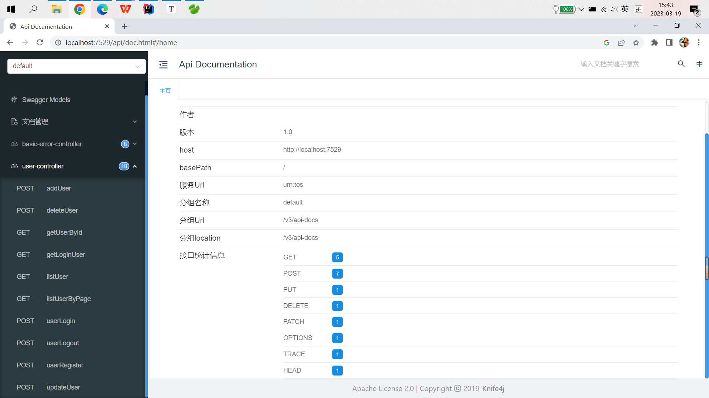

<<<<<<< HEAD
# 请销假管理系统

访问 localhost:5976/api/doc.html 就能在线调试接口了，不需要前端配合啦~

=======
# Management-system-template
该项目为管理系统类的多个项目的集合（持续更新中...）。像用户中心管理、请销假管理、图书管理、超市管理等系统。入门级练手项目，目的在于巩固基础，熟悉企业项目开发流程，便于Java初级爱好者在学习完某一部分Java知识后有一个合适的项目锻炼、运用所学知识，完善知识体系。
